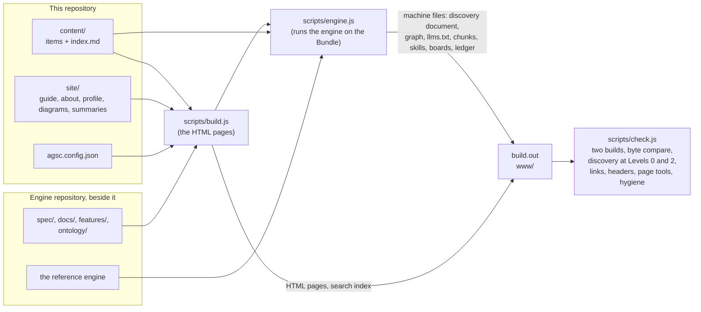

# How this site is built

**Summary.** One command, `node scripts/build.js`, turns this repository's Bundle and
authored pages, together with the engine repository beside it, into the static site in
`build.out`. The generator writes the HTML pages; the reference engine writes every
machine file whose bytes a rule pins; the gate, `node scripts/check.js`, builds twice,
compares the bytes and checks the result as a stranger would. Nothing is fetched from the
network, and the build instant is fixed, so the same inputs always give the same site.

**Who this is for:** a contributor to the generator or a reviewer of the site's output.
**Read after:** the repository [README](../README.md).

The picture above is rendered from this Mermaid source; the source is the truth.

## The parts

| Step | What happens | Where |
|---|---|---|
| Read | the configuration, the items of `content/`, the guide pages of `site/docs/`, and from the engine repository the specification, the requirements, the scenarios, the ontology and the plain-language pages | `scripts/build.js` |
| Engine | the Bundle is copied to `dist/engine-bundle/` and built by the engine; its machine files (discovery document, graph views, `llms.txt`, chunks, search index, skill packs, boards, ledger, `/ns/`) are taken as they are | `scripts/engine.js` |
| Pages | every HTML page — items, the specification, the guide, search, compose, the front page — in the engine's default theme | `scripts/build.js` |
| Front page | the "works with" lists are read from the engine's registries and the measured numbers from its `docs/measurements.json`; the build stops if a name on the page has no registry entry | `scripts/build.js` |
| Gate | two builds must be byte-identical; the discovery document passes the engine's `tools/validate-wellknown` at Levels 0 and 2; links, headers, contrast, the page tools and public hygiene are checked | `scripts/check.js` |

The instant every date on the site derives from is `SOURCE_DATE_EPOCH`, or the last
commit when it is unset. Until the specification's tag exists the build reads the
engine's working tree, and says so in its first line of output.
